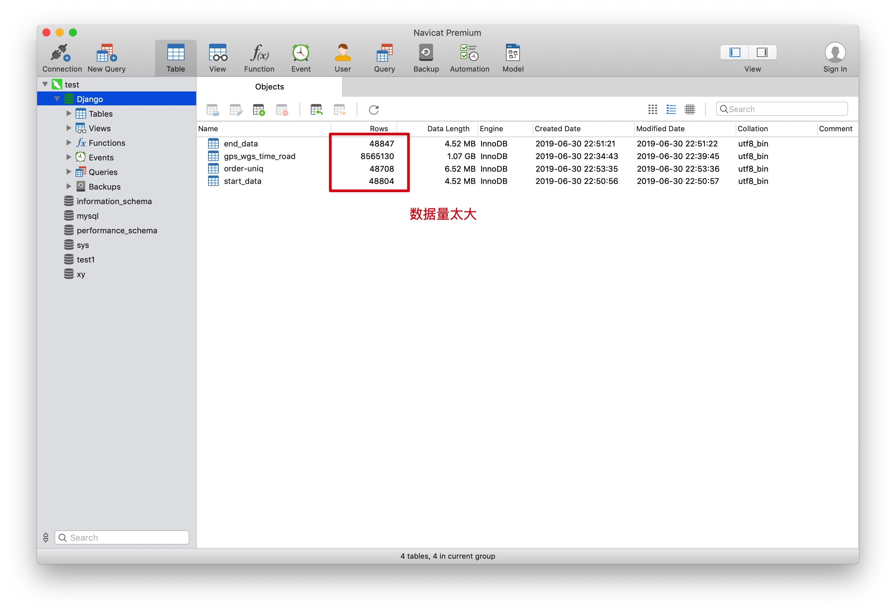
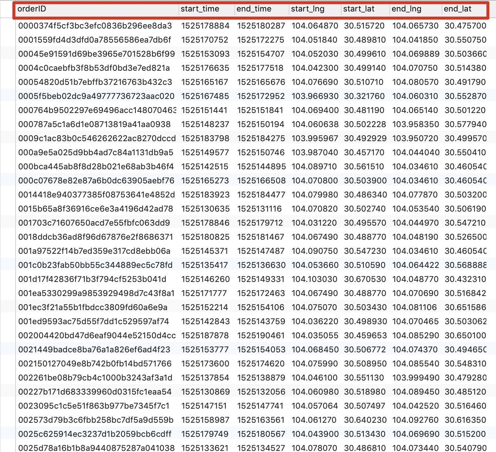
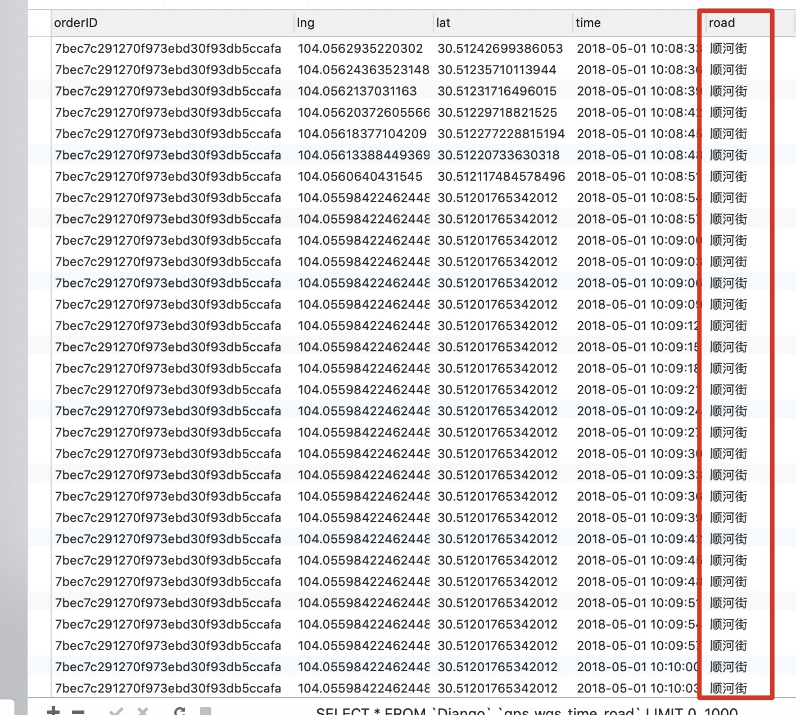
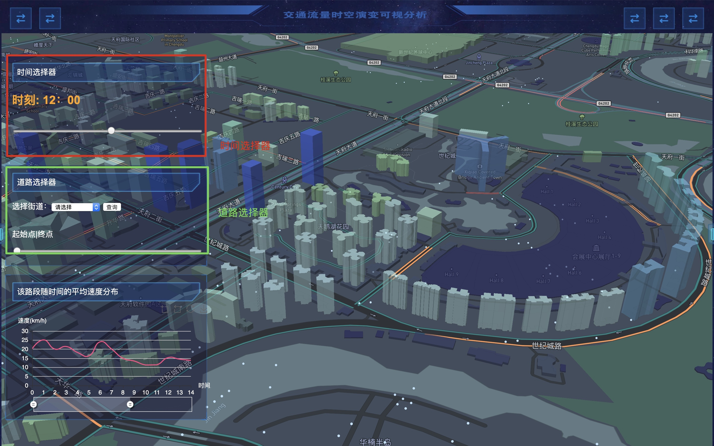
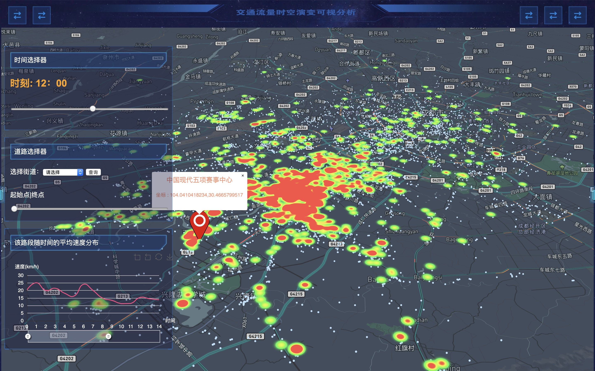
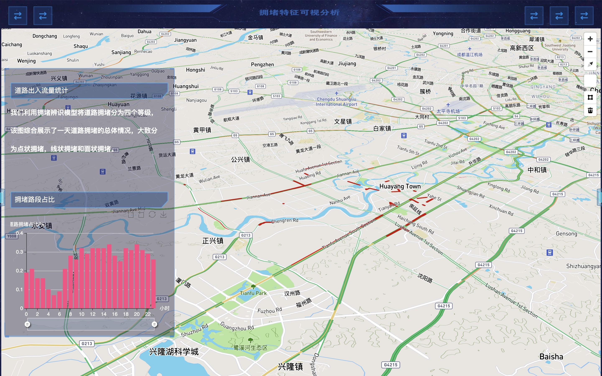
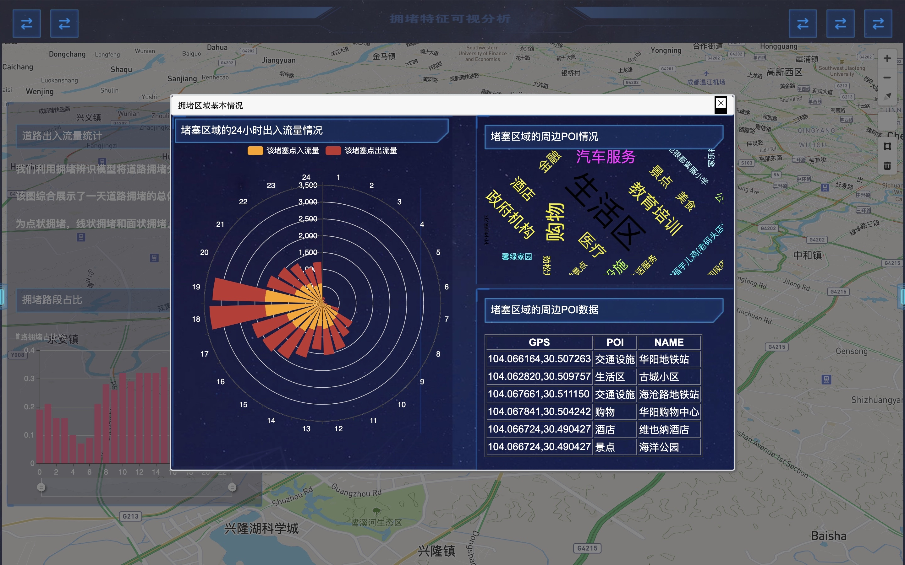
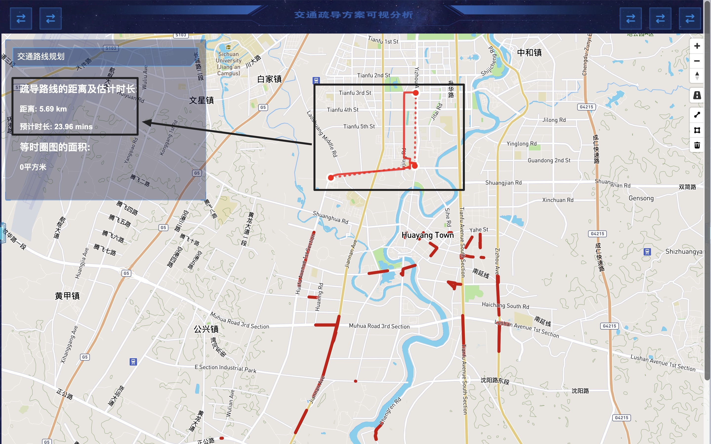
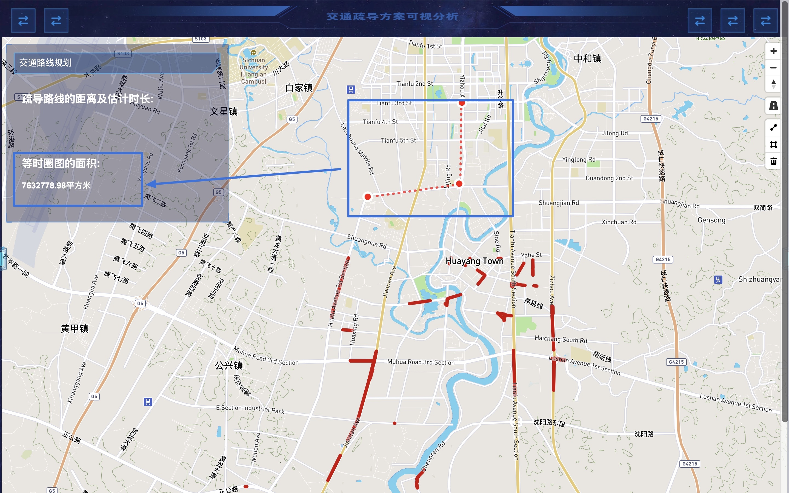
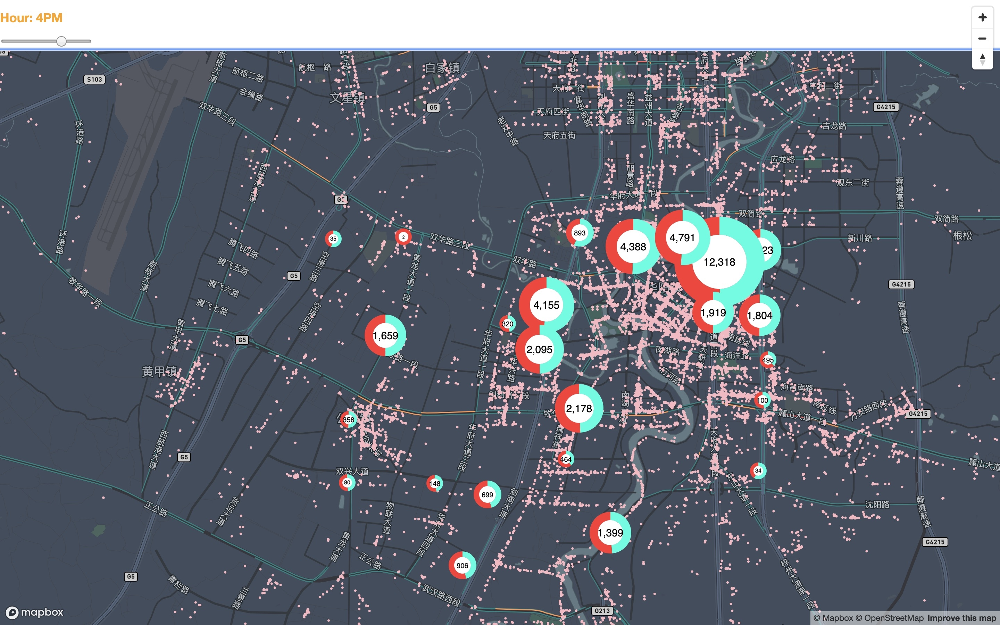

## 数据库设计目的
这次数据利用的是我前一段时期在 Chinavis 挑战赛的数据,在挑战赛初期,想做一个纯凭文件操作的 I/O 操作,但是发现频繁的 I/O 操作机器是根本是处理不了的.所以这次我们实现的是一个系统来实现整个 900 万数据的处理的过程   

<strong>框架 : python 的 Django 框架 
前端 : Ecahrts.js Mapbox.js vue.js
后端数据库 : Mysql </strong>

-------

## 数据介绍
本次比赛提供两份2018年5月1日的数据：
（1）成都滴滴平台快车和专车在中国现代五项赛事中心10公里范围内的订单数据，记录了当天平台订单的起止地点（Origin-Destination），约5万行记录；
（2）成都滴滴平台快车和专车在中国现代五项赛事中心10公里半径范围内的轨迹数据，记录了数据1中网约车行驶过程中的时间与位置信息，约900万轨迹点数。两份数据未压缩约0.5GB。下面是两份数据的字段说明。

-------
**轨迹数据(gps20180501)**

| 订单ID | String | mjmwfrqvI | 使用MD5+SALT加密方式进行了脱敏处理 |
| ------ | ------ | -------------------------------- | ---------------------------------- |
| 时间戳 | String | 1501584540   | unix时间戳，单位为秒               |
| 经度   | String | 104.04392        | GCJ-02坐标系|
| 纬度   | String | 30.6863   | GCJ-02坐标系                       |

**订单数据（order-uniq-20180501）**

| 字段         | 类型   | 实例                             | 备注                               |
| ------------ | ------ | -------------------------------- | ---------------------------------- |
| 订单ID       | String | mjiwdgkqmrqvI | 使用MD5+SALT加密方式进行了脱敏处理 |
| 开始计费时间 | String | 1501581031| unix时间戳，单位为秒               |
| 结束计费时间 | String | 1501582195| unix时间戳，单位为秒               |
| 上车位置经度 | String | 104.11225| GCJ-02坐标系                       |
| 上车位置纬度 | String | 30.66703 | GCJ-02坐标系                       |
| 下车位置经度 | String | 104.07403| GCJ-02坐标系                       |
| 下车位置纬度 | String | 30.6863 | GCJ-02坐标系                       |

-------
## 数据的预处理
1. 对于 time 时间戳进行转换,时间戳转化为年月日.

2. 因为开始只有经纬度和时间,此时 我们利用百度的 api 进行900 万地理逆坐标转化,将经纬度转换为相应的街道,并且将时间转换成我们要的格式.

-------

## 界面 1

-------

实现原理:
    1. **时间选择器**: 通过第一个时间选择器,前端进行选择,然后通过将前端传回来的时间参数 Django 框架进行处理,通过后端 Mysql 的查询语句进行筛选,将符合条件的时间数据进行传回,随后通过 Mapbox.js 热力图的前端处理来进行地图的展示.
    2. **道路选择器**: 通过第一个道路选择器,前端进行选择,然后通过将前端传回来的道路参数 Django 框架进行处理,通过后端 Mysql 的查询语句进行筛选,将符合查询条件的数据进行传回,随后通过 Mapbox.js 的热力图和左下角第三个页面进行此条道路本天交通流量的变化,前端处理来进行地图的展示.
    
-------

## 界面 2

-------

实现原理:
    1. 通过后端对数据进行处理,对于拥堵道路进行分级,其中途中红色代表最拥堵,逐次递进代表拥堵情况降低.
    2. 通过框选所在道路,调用 mapbox 的 API 函数,获得道路的基本信息(经纬度,道路的名称),然后将这些前端获得的数据出入到后端,对数据库实现添加操作,对框选的数据进行记录,同时可以重复框选,后端数据库进行修改操作.
    3. 前端在框选操作结束时,触发弹出框函数,前端进行弹框; 后端接收到对应前端传过来的道路参数后,迅速进行查询,将这些数据返回到 Django 框架的数据处理层,Django 框架的数据处理层进行对数据的统计与分析(将框选数据的道路词频进行统计,以词云图的形式将返回数据的高频词进行展示,通过极坐标堆叠图分析所给道路的 24 小时时序拥堵情况) 
    4. Django 数据处理层处理数据之后,再一次将处理好的数据传到已经弹出的弹出框中,实现所选道路的展示
   
-------
 
## 界面 3

-------

实现原理:
    1. 首先对数据进行分析,将所有的数据按照 24 小时进行分割,得到每一个小时的流量走向的折线图.
    2. 起始时,显示是经过数据处理后的总的 24 小时每条道路的流出流入的总体情况,并对其选择道路的流入流出情况(以 10s 为单位)通过折线图进行展示
    3. 通过在选择框中输入要查询的时间点,显示是相应时间点的道路流出流入情况,可以通过弦图显示具体这条道路流向其他道路的情况,弧度越大代表流出到响应的道路的流量越多
   
-------
## 界面 4

-------

实现原理:
    1. 通过对所选择道路的选择,前端将所选道路的道路名称进行框选筛选,传到后端 Django 框架中,查询数据库相应道路的经纬度,通过调用 Maobox 的最短路径 api 函数进行数据的分析,得出所选两点的距离及预计时长.
    2. 通过对所选点周围进行筛选,利用等时圈图来刻画周围的拥堵情况,通过等时圈图的面积来进行拥堵情况的定量表示
    
-------
## 界面 5

-------

实现原理:
    1. 利用多尺度环形图,通过定位到每一条街道,将此条道路的流入流出情况通过环形图的方式进行刻画,从而得出此条道路流入流出情况,将流入与流出的占比作为一个衡量拥堵情况的重要指标.
    2. 通过环形图的圈的大小代表此条道路周围的的流量情况,圈的面积越大,代表此条道路的流入流出情况较为频繁(同时也就和打车的数据进行了比较,我们可以看出,打车较为频繁的地方,其周围道路的流量也就越大,更容易出现拥堵情况.
    3. 最后通过一个时间选择器进行筛选,通过筛选特定时刻的相应道路的情况,来动态实时的了解所有道路的流入流出情况及此事此条道路周围的流量大小情况.
        
-------

## 数据库运用说明
1. 本次利用的是 Django➕Mysql ,其中 Mysql 方面,利用所提供的数据,分成了四张表,数据量大小分别是 5 万起点数据, 5 万终点数据, 5 万订单数据,900 万GpS数据.
2. 设计的数据库操作:
  - **增**: 对于界面 2 与界面 4 的选定区域的参数(包括 道路的信息,道路的 gps 数据),要存入到数据库中,方便进行查询.
  - **改**: 对于界面 3 中,查询的时间不同,对于所在数据库中临时存储的 Gps 数据也是要随之进行修改,方便下次进行查询
  - **查**: 这是本次用的最多的一次数据库操作,因为本次数据库设计的目的就是对数据进行有效的管理,方便调用.
  - **注**:没有删除操作,因为删除对于此次赛题的完成没有操作
  
## 关于本次数据库的出现的不足
最后即使是运用了 Mysql 数据库,还是出现了查询 5 分钟以上的情况(在查询大约 100 万数据点时),做完比赛之后思考了一下.
今后可以实现三个方法:
1. 加索引:因为此次没有删除的操作,所以不涉及索引的大量修改的问题,用索引较为合理
2. 换 MongoDB 数据库:GPS,订单的数据格式也比较适合 MongoDB,且 MongoDB 是在内存中进行操作的,理论上会更快一些,这些都有待实验
3. 在数据进行运用时,加上数据压缩过程:虽然 900 万是一个客观事实,但是主观上还是可以通过数据压缩来进行处理,并且通过观看其他队伍的效果,确实起到了不错的效果.这样就不会出现查询 5 分钟的情况,造成了前端无法获得对应的数据,很多功能都无法实现.

## 总计
* 本次首次实现了一个前后端交互的系统,虽然在数据的压缩,挖掘方面还是出现了不小的问题,但是在数据的管理方面有了很多的进步,可以实现大规模数据的有效存储并调用.
* 在数据库的优化方面可以再后续中继续深化, 这次实践后更加理解了大数据,一些简单地操作在大数据的环境下或许都是无法满足用户操作需求的.
* 以后再设计系统的时候要综合考虑前端需求和后端数据管理,中间层的数据处理,数据库的范式等条件,进行综合的性能权衡,而不是仅仅考虑到自己要实现的前端界面,这样对资源消耗太大,而且通常也达不到效果.
* 从这次系统的设计,学到了更多的从顶层设计就要考虑的问题,不能看一步做一步,为自己留下一个个隐患.
  